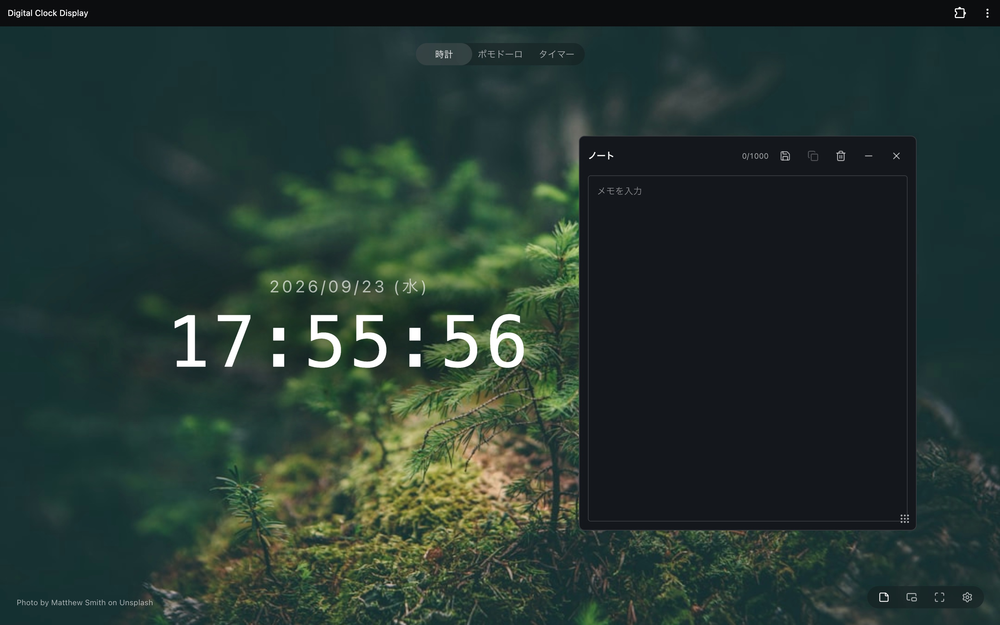
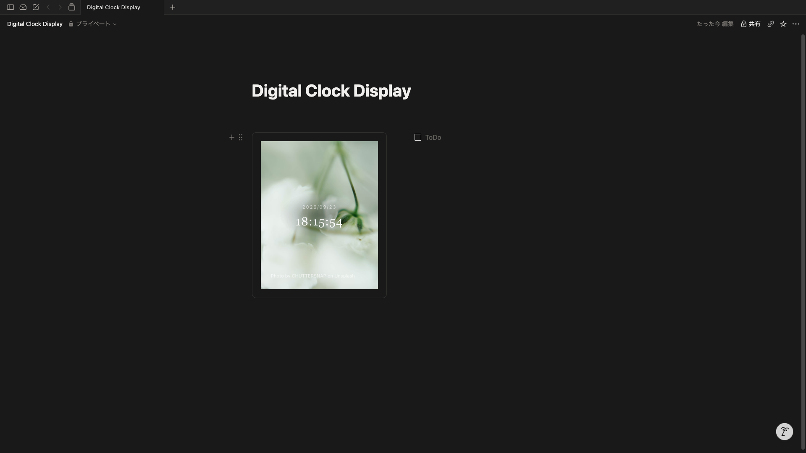

# Digital Clock Display

作業中、時刻と残り時間を視界の端で確認できる時計アプリ。
時計、ポモドーロ、タイマーを切り替えて使えます。

## できること

- **時計**：時刻と日付を表示。書体、文字サイズ、配置、文字色を調整できます。
- **ポモドーロ**：作業、短い休憩、長い休憩の時間とセット数を設定。進捗と次の状態を表示します。
- **タイマー**：時間を直接入力するか、プリセットから選択。残り時間と進捗を表示します。

背景には Unsplash の写真や手元の画像、単色を使えます。
操作しない間はボタンとカーソルが隠れ、時間の表示に集中できます。

## 表示方法

ブラウザの全画面表示に加え、Picture-in-Picture、PWA、Notion への埋め込みに対応しています。
スマートフォンでも利用できます。

